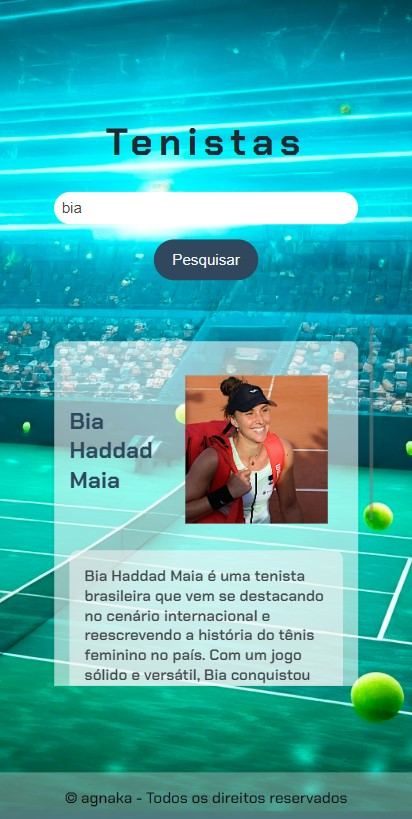

### **Tenistas: A sua plataforma para fãs de tênis!** 
**Considerações inicias**

Este site faz parte da Imersão Dev com Google Gemini, ministrada pela Alura junto com a Google.
Instrutores Rafaella Ballerini e Guilherme Lima da Alura e Luciano Martins da Google.
Desde já o agradecimento pelas aulas magníficas!

**_Imagem do Site_**
A imagem de background foi solicitada ao Gemini especificando o mais possível no prompt o que estava querendo.

  <figure>
    
    <figcaption>Tela computador</figcaption>
  </figure>
  <figure>
    
    <figcaption>Tela celular</figcaption>
  </figure>

 

**O que faz essa aplicação?**

Essa aplicação simples e divertida permite que você pesquise por seus tenistas favoritos! Basta digitar o nome do tenista ou uma palavra-chave relacionada e pronto! Você terá acesso a informações sobre diversos atletas.

**Como funciona?**

1. **Digite e pesquise:** Na barra de pesquisa, digite o nome do tenista que você quer saber mais.
2. **Veja os resultados:** A aplicação irá procurar por todos os tenistas que correspondem à sua pesquisa e exibir os resultados de forma clara e organizada.
3. **Explore:** Clique nos links para saber mais sobre cada tenista.

**Tecnologias utilizadas:**

*  
* 
* 

**Responsividade:**

Acrescentei as alterações para uso no celular. A foto dos tenistas pasó para ao lado do nome é ficou menor como assim a caixa dos resultados para caber na tela menor.

**Como usar este projeto:**

1. **Clone o repositório:** Use o Git para clonar este repositório em sua máquina.
2. **Abra o projeto:** Abra o arquivo `index.html` em seu navegador.
3. **Divirta-se:** Comece a pesquisar por seus tenistas favoritos!

**Quer contribuir?**

Adoraria ver suas contribuições! Se você tiver alguma ideia para melhorar a aplicação, sinta-se à vontade para abrir um pull request.

**Observações:**

* **Dados:** Os dados dos tenistas estão armazenados no arquivo `dados.js`. Você pode adicionar ou remover tenistas à vontade.
* **Estilo:** Sinta-se livre para personalizar o estilo da aplicação de acordo com seu gosto. O arquivo `styles.css` é todo seu!
* **Funcionalidades:** Podemos adicionar novas funcionalidades no futuro, como:
    * **Ordenação:** Ordenar os resultados por nome, ranking ou outra critério.
    * **Filtros:** Adicionar filtros para pesquisar por nacionalidade, estilo de jogo, etc.
    * **Detalhes:** Mostrar mais detalhes sobre cada tenista, como títulos, estatísticas, etc.
* **Goolge Gemini:** Todo o projeto foi assistido pelo Google Gemini, como este README que foi feito com ajuda dele.

**Vamos juntos criar a melhor plataforma para fãs de tênis!** 

**#tenistas #programação #javascript #html #css #open-source**

